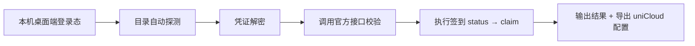

# 一个 JS 文件搞定三个 AI IDE 的自动签到：Trae / WorkBuddy / Qoder 凭证解析实战

> 仓库地址：[https://github.com/WMJ-D/auto-sign-skills](https://github.com/WMJ-D/auto-sign-skills)
>
> 声明：本项目仅供个人学习与程序研究参考，禁止商用。自动化操作第三方平台可能违反其用户协议或触发风控，由此产生的一切后果由使用者自行承担。

## 一、背景

Trae、WorkBuddy（CodeBuddy CN）、Qoder 这三个 AI 编程桌面端都有"每日签到领积分/额度"的活动，但各家都没有提供官方的签到 API 文档，也没法用一条命令完成签到。每天手动打开三个客户端点一遍，既繁琐又容易忘。

这个项目做的事情很纯粹：

- **一个零依赖的 Node.js 脚本**（`get-credentials.js`），从本机三个客户端的本地数据中解出登录凭证；
- **直接调用各平台的签到接口**完成签到，也可以把凭证导出成 uniCloud 云函数配置，交给定时任务跑；
- **封装成一个 Trae Skill**，让 AI 助手可以按需自动执行"读取凭证 + 签到 + 排查失败原因"的完整流程。

整个项目没有任何 `npm install`，只用了 Node 内置模块 + Windows 自带的 PowerShell。

## 二、总体方案

```
auto-sign-skills/
├── get-credentials.js                 # 核心脚本：读凭证 → 校验 → 签到 → 导出配置
├── 一键获取签到凭证.bat                # 双击运行脚本
└── .trae/
    └── skills/
        └── auto-sign-cloud/
            ├── SKILL.md               # Trae Skill 定义
            ├── get-credentials.js     # 脚本副本（Skill 自包含）
            └── 一键获取签到凭证.bat
```

执行流程：



三个平台的凭证存放方式和鉴权方式完全不同：

| 平台 | 凭证存放位置 | 本地加密方式 | 接口鉴权 |
|------|-------------|-------------|---------|
| Trae | `%APPDATA%\TRAE SOLO CN\User\globalStorage\storage.json` | 自研 envelope（AES-128-CBC + SHA512） | `Cloud-IDE-JWT <token>` + `x-device-id` + `X-User-Region` |
| WorkBuddy | `%APPDATA%\CodeBuddy CN\User\globalStorage\state.vscdb` | SQLite + Chromium OSCrypt（AES-256-GCM + DPAPI） | `Bearer <token>` + `X-User-Id` |
| Qoder | `%APPDATA%\QoderCN\User\globalStorage\state.vscdb` | SQLite + Chromium OSCrypt | `Bearer <token>` + `Cosy-ClientType: 10` |

## 三、关键技术实现

### 3.1 多版本目录自动探测

踩过的第一个坑：**客户端目录名不固定**。Trae 官网现在叫 `traeCode` / `traeWork`，本地数据目录却可能是 `TRAE SOLO CN`、`TraeCode CN` 等；Qoder 存在 `QoderCN`（中国版）和 `Qoder`（国际版）两套目录；不同机器装的是哪一种根本无法预知。

解法是"按必需文件存在性探测"，而不是写死目录名：

```js
function resolveProfileRoot(names, requiredFiles) {
  for (const name of names) {
    const root = path.join(APPDATA, name);
    if (requiredFiles.every(file => fs.existsSync(path.join(root, file)))) return root;
  }
  return path.join(APPDATA, names[0]); // 兜底，让报错信息指向最常见目录
}

const TRAE_ROOT = resolveProfileRoot(
  ['TRAE SOLO CN', 'TraeCode CN', 'TraeWork CN', 'Trae CN', 'TraeCodeCN', 'TraeWorkCN'],
  [path.join('User', 'globalStorage', 'storage.json')]
);
```

要点：

- 探测条件是"凭证文件真的存在"，而不是"目录存在"——避免命中一个空壳目录后报出更迷惑的 JSON 解析错误；
- 运行时打印实际命中的目录（`[Trae] 使用数据目录: ...`），排查问题时一眼就能看到脚本读的是哪里。

### 3.2 Trae 凭证信封解密

Trae 的 `storage.json` 里，登录态存在 `iCubeAuthInfo://icube.cloudide` 这个 key 下，是一段 base64 的自定义信封，格式为：

```
[6字节魔数][32字节随机密钥][AES-128-CBC 密文]
密文解出后：[64字节 SHA512 校验头][JSON 明文]
```

解密流程全部用 Node 内置 `crypto` 完成：

```js
function traeDecryptEnvelope(b64) {
  const env = Buffer.from(b64, 'base64');
  if (env.length <= 38 || !env.subarray(0, 6).equals(TRAE_HEADER)) throw new Error('凭证信封格式无效');
  const randomKey = env.subarray(6, 38);
  const secret = Buffer.from(TRAE_LEFT.map((b, i) => b ^ TRAE_RIGHT[i]));   // 两组常量异或出 secret
  const derived = sha512(Buffer.concat([sha512(randomKey), secret]));       // 双层 SHA512 派生 64 字节
  const decipher = crypto.createDecipheriv('aes-128-cbc',
    derived.subarray(0, 16), derived.subarray(16, 32));                     // 前 16 字节作 key，后 16 字节作 IV
  const plain = Buffer.concat([decipher.update(env.subarray(38)), decipher.final()]);
  const payload = plain.subarray(64);
  if (!crypto.timingSafeEqual(plain.subarray(0, 64), sha512(payload))) throw new Error('凭证完整性校验失败');
  return JSON.parse(payload.toString('utf8'));
}
```

解出来的 JSON 包含 `token / userId / host / userRegion` 等字段，正好覆盖签到接口需要的所有请求头。

一个隐蔽的坑：**`host` 字段的值可能被反引号包裹**，形如 `` `https://api.trae.cn` ``，直接拿去拼 URL 请求就会失败，必须清洗：

```js
const host = String(rawHost).replace(/[反引号`]/g, '').trim();
```

### 3.3 手写最小 SQLite 读取器

WorkBuddy 和 Qoder 的凭证存在 `state.vscdb`（SQLite 文件）的 `ItemTable` 里。为了保持零依赖，脚本内实现了一个约 100 行的最小 SQLite 读取器，只做一件事：**遍历所有 leaf table b-tree 页（页类型 `0x0d`），还原每行 `[key, value]`**。

核心步骤：

1. 从文件头读 `pageSize`（偏移 16）和每页保留字节数 `reserved`（偏移 20）；
2. 逐页判断页类型，只处理 `0x0d`（table leaf），解析 cell 指针数组；
3. 每个 cell 依次读 `payload 长度` 和 `rowid` 两个 varint；
4. 若 payload 超过页内可用空间，按 SQLite 标准公式计算本页保留量 `K`，剩余部分沿**溢出页链**（每页前 4 字节是下一页号）拼接；
5. 按 record header 里的 serial type 逐列解析，取前两列即 key/value。

这个实现最容易被忽略的是**溢出页链**——凭证 JSON 往往好几 KB，远超单页容量，不支持溢出链的话 key 能读到、value 却是残缺的，解密必然失败。

另外，客户端运行时 `state.vscdb` 处于**独占锁**状态，直接 `readFileSync` 会报 `EBUSY`。脚本先复制到临时目录再读：

```js
function copyFileUnlocked(src) {
  const tmp = path.join(os.tmpdir(), `cred_${Date.now()}_${Math.random().toString(36).slice(2)}.bin`);
  fs.copyFileSync(src, tmp);
  const buf = fs.readFileSync(tmp);
  try { fs.unlinkSync(tmp); } catch {}
  return buf;
}
```

### 3.4 Chromium OSCrypt + DPAPI：两层解密拿到 token

`state.vscdb` 里的 value 不是明文，而是 Chromium 系应用通用的 OSCrypt 密文（以 `{"type":"Buffer","data":[...]}` 的 JSON 文本存储）。解密链路是两层：

```
Local State 的 os_crypt.encrypted_key (base64)
    └─ 去掉 "DPAPI" 前缀 ──> DPAPI 解密 ──> AES-256-GCM 主密钥
state.vscdb 里的密文
    └─ "v10" + 12字节 nonce + 密文 + 16字节 tag ──> AES-256-GCM 解密 ──> 账号 JSON 明文
```

DPAPI 解密不想引入任何依赖，就直接调 Windows 自带的 PowerShell + .NET：

```js
function dpapiDecrypt(blobBuf) {
  const bin = path.join(os.tmpdir(), `dpapi_..._.bin`);
  fs.writeFileSync(bin, blobBuf);
  const ps = `Add-Type -AssemblyName System.Security;` +
    `$b=[IO.File]::ReadAllBytes('${bin}');` +
    `[Convert]::ToBase64String([Security.Cryptography.ProtectedData]::Unprotect($b,$null,` +
    `[Security.Cryptography.DataProtectionScope]::CurrentUser))`;
  const out = execSync(`powershell -NoProfile -NonInteractive -Command "${ps}"`, { timeout: 20000 });
  return Buffer.from(out.trim(), 'base64');
}
```

AES-GCM 部分则完全在 Node 里完成：

```js
function chromiumDecrypt(encryptedBuf, aesKey) {
  // 密文 = "v10"(3) + nonce(12) + ciphertext + tag(16)
  const nonce = encryptedBuf.subarray(3, 15);
  const tag = encryptedBuf.subarray(encryptedBuf.length - 16);
  const data = encryptedBuf.subarray(15, encryptedBuf.length - 16);
  const decipher = crypto.createDecipheriv('aes-256-gcm', aesKey, nonce);
  decipher.setAuthTag(tag);
  return Buffer.concat([decipher.update(data), decipher.final()]).toString('utf8');
}
```

两个平台复用同一套解密逻辑，差别只在 secret key：

- WorkBuddy：`secret://{"extensionId":"tencent-cloud.coding-copilot","key":"planning-genie.new.accessTokencn"}`，明文 JSON 里真正的 Bearer token 在 `auth.accessToken`（顶层的 `accessToken` 是个 UUID 复合串，不能用）；
- Qoder：`secret://aicoding.auth.userInfo`，token 在 `userInfo.token`，格式是 `dt-` 开头的短 token。

### 3.5 三平台签到流程与幂等设计

签到统一遵循「先查状态，再领奖」的两段式，避免重复请求：

| 平台 | 查状态 | 领奖 | 已签到幂等码 | 特殊处理 |
|------|--------|------|-------------|---------|
| Trae | `POST /trae/api/v2/ug/checkin_credits/status` | `POST .../checkin_credits/claim`，body `{req_source:1}` | `checked_in=true` 或 code `1001` | code `9074` 限流：2s/5s/10s 三次退避重试 |
| WorkBuddy | `POST /v2/billing/meter/checkin-activity-status` | `POST .../daily-checkin` | `today_checked_in=true` 或 code `10001` | — |
| Qoder | `GET /sash/api/v1/me/campaigns` | `POST .../campaigns/{id}/claim` | `claimable=false` 或无 `CLAIMABLE` 活动 | 逐个领取 `CLAIM_BENEFIT` 活动，`replayed=true` 视为已领 |

Trae 的两个细节值得强调：

- **`X-User-Region` 头缺失会直接触发 9074 风控**，这个值要从信封 JSON 的 `userRegion.region` 里取；
- 9074 重试用尽后回查一次 status——有时候 claim 实际已到账，只是响应被限流吃掉了。

Qoder 的活动接口每天 10:00 刷新 `campaignId`，所以领取前必须实时拉活动列表，不能缓存。

### 3.6 安全处理

凭证是整个工具最敏感的部分，脚本做了三层防护：

1. **控制台只打码**：`mask()` 只展示前 10 位 + 后 6 位；
2. **完整配置只落地到本地** `签到凭证.txt`（已在 `.gitignore` 中排除 `*.txt`），同时复制到剪贴板方便粘贴；
3. **JWT 过期时间解析**：直接解 token 的 payload 读 `exp`，过期就明确提示"重新打开客户端登录后再跑脚本"，而不是拿过期 token 去打接口看报错。

一个真实教训：调试时把控制台完整输出（含明文 token）贴到聊天里排查问题，等于把凭证公开了。**任何包含完整 token 的日志都不应该外发**，正确的做法是重新登录客户端让旧 token 失效。

## 四、封装成 Trae Skill

把脚本进一步封装成 Skill，是为了让 AI 助手能"自己完成"整个闭环：用户只要说"帮我签到"或"Qoder 签到失败了帮我看看"，助手就会按 SKILL.md 的指引执行。

Skill 的目录结构（项目级）：

```
.trae/skills/auto-sign-cloud/
├── SKILL.md
├── get-credentials.js
└── 一键获取签到凭证.bat
```

SKILL.md 的关键是 frontmatter——`description` 是路由器唯一能看到触发信息的字段，必须写清楚"做什么 + 什么时候用"：

```yaml
---
name: auto-sign-cloud
description: 读取本机 Trae、WorkBuddy 或 CodeBuddy、Qoder 登录凭证并执行三平台积分签到。用户要求获取签到凭证、执行自动签到或排查平台凭证时使用。
---
```

正文则写约束而非百科：执行命令、失败原因的分类判断（目录不存在 / 未登录 / token 过期 / 接口失败）、"不输出完整 Token""不提交凭证文件""凭证失效先重新登录"等安全规则。

## 五、踩坑清单

1. **host 被反引号包裹** → 所有从信封解出的 URL 字段统一清洗反引号。
2. **目录名多版本**（`QoderCN` / `Qoder` / 新版 Electron 应用的 `com.qodercn.app.stable`）→ 按必需文件探测目录，而不是写死路径；新版 Electron 应用若认证改存独立数据库并附带 `Cosy-Machine*` 机器头，旧读取方式拿到的 token 必然 `TOKEN_EXPIRE`，此时唯一正确解法是安装登录对应版本客户端。
3. **SQLite 文件被占用** → 复制到临时目录再解析。
4. **溢出页链不拼** → 大 value 解析残缺，AES-GCM 校验直接失败。
5. **WorkBuddy 顶层 `accessToken` 是假 token** → 真正的 Bearer 凭证在 `auth.accessToken` 嵌套层。
6. **网络原因 GitHub 连不上** → 提交前 `git pull --rebase` 失败时不要硬推，先解决网络或换镜像。

## 六、使用方式

环境要求：Windows + Node.js，且三个桌面端至少登录过一次。

```powershell
# 方式一：命令行
node "get-credentials.js"

# 方式二：双击
一键获取签到凭证.bat
```

输出包含三部分：

1. 各平台凭证脱敏预览 + 有效期 + 接口实测校验结果；
2. 三平台实时签到结果（已签到会幂等跳过）；
3. uniCloud `auto_sign_config` 集合的三条配置 JSON（写入 `签到凭证.txt` 并复制到剪贴板），可直接粘进云函数项目做定时签到。

token 过期后（Trae 约 2 周、WorkBuddy/Qoder 以各自有效期的 `exp` 为准），重新登录对应桌面端再跑一次脚本即可续期。

## 七、小结

这个项目的技术含量不在单个环节，而在**把三种完全不同的本地凭证体系（自研信封加密、SQLite + OSCrypt + DPAPI、每日轮换的活动接口）用零依赖的方式统一收敛到一个 700 行的脚本里**，再通过 Skill 把"人肉排障经验"固化成 AI 可执行的流程。

对类似"本地客户端凭证自动化"需求的场景，可复用的经验是：

- 先用抓包/日志确认官方客户端的真实请求头集合，再决定脚本要哪些字段；
- 目录探测永远以"必需文件存在"为准，版本迭代才不会把脚本打断；
- 幂等码和限流退避要在第一版就设计进去，否则每天定时任务会在风控边缘反复横跳。
